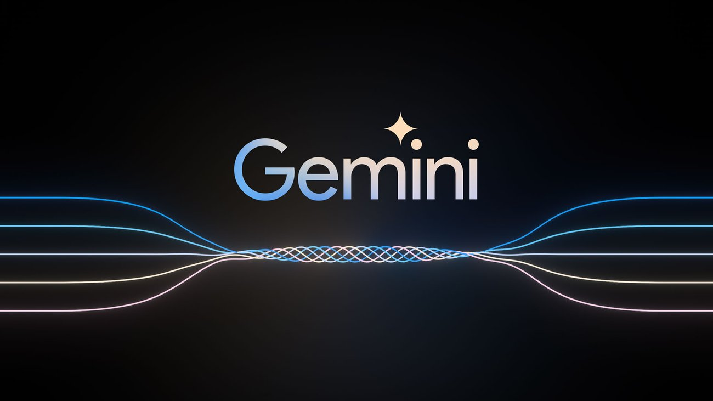

#                                                      Generative-AI-Google-Gemini

  

### Key Features of Google Gemini:
- Multimodal Capabilities:

     Unlike earlier models that focus only on text-based tasks, Gemini is designed to process and generate not only textbut also other forms of data
     such as images, video, and even audio. This makes it highly versatile for a wide range of applications.
  
- Advanced Natural Language Processing (NLP):

     Gemini enhances the capabilities of traditional NLP models by incorporating context more deeply, leading to more accurate and coherent responses.
     It can handle complex tasks such as question answering, summarization, translation, and content generation with higher levels of fluency and relevance.
  
- Scalability:

    Google Gemini is designed to scale efficiently, handling vast amounts of data and user inputs simultaneously. This makes it suitable for enterprise-level 
    applications, where the need for rapid, large-scale data processing is crucial.
  
- Real-World Integration:

     The Gemini AI models are designed to be integrated into Google’s suite of products, such as Google Search, Google Assistant, Google Workspace, and more.
     This allows for seamless interactions across various platforms, helping users solve real-world problems using natural language interactions.
  
- Human-Like Understanding:

     One of the goals of Gemini is to emulate human-like reasoning and understanding. The model is built with improvements in contextual awareness,
     long-term memory, and reasoning capabilities, enabling more accurate predictions and personalized responses.
  
- Ethical AI and Safety:

     Google places a strong emphasis on ensuring the safety, fairness, and ethical use of AI models. Gemini incorporates advanced safety protocols
     to reduce the chances of generating harmful, biased, or inappropriate content. It also includes mechanisms to detect and mitigate AI hallucinations,
     where the model might provide misleading or fabricated information.
  
- Domain-Specific Expertise:

     Gemini can be fine-tuned for specific domains, such as healthcare, education, finance, and more. This allows it to deliver highly specialized outputs
     tailored to industry-specific needs, providing companies and professionals with AI solutions that understand their particular challenges.
  
### Applications of Google Gemini:
  - Content Creation: Gemini can be used to generate high-quality written content, from articles and blogs to creative writing, marketing material, and more.

  - Customer Service: By integrating into chatbots or virtual assistants, Gemini can provide more intelligent, context-aware customer service, addressing complex queries and improving user experience.

  - Healthcare: In healthcare, it can assist in summarizing medical documents, providing patient information, and generating research insights based on large datasets.

  - Research and Education: For researchers and educators, Gemini can help summarize research papers, provide explanations, answer queries, and even assist in generating educational materials or simulations.

### Future Potential:
   Google Gemini is expected to play a critical role in the evolution of AI, enabling more human-like interactions with machines. 
   As AI becomes more embedded in everyday tools and services, models like Gemini will be key to driving innovation in how people 
   and businesses use technology to solve complex problems.

